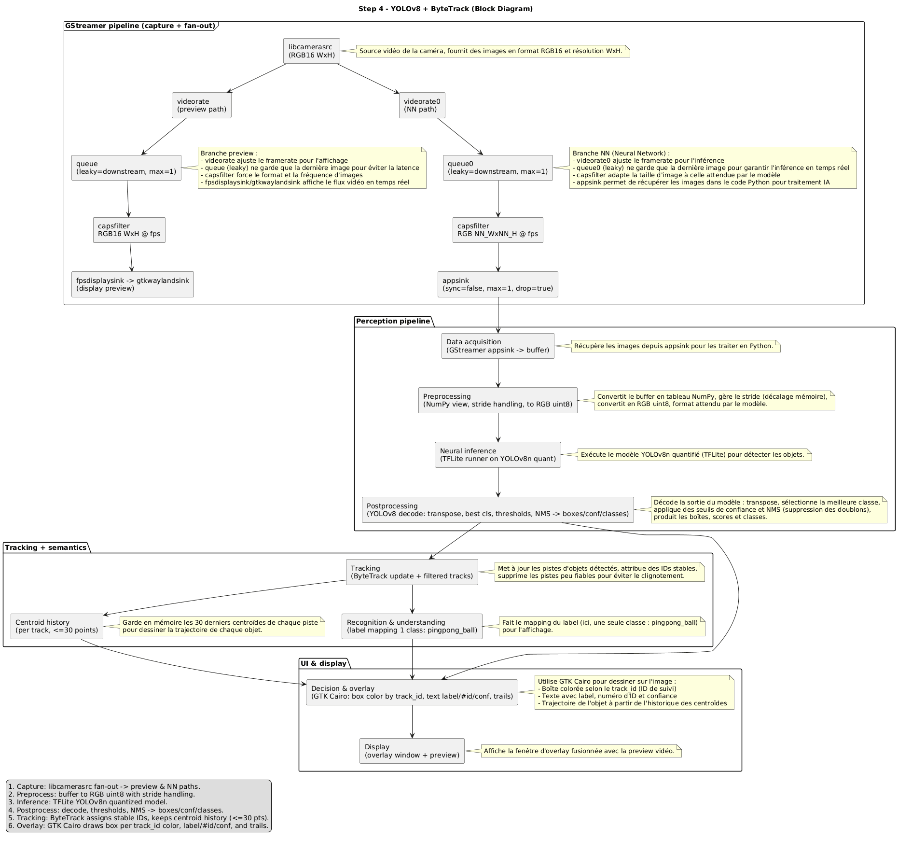
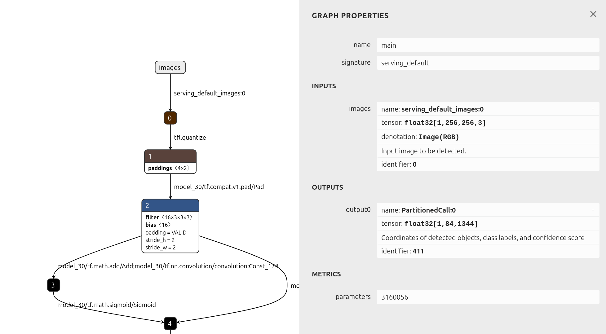
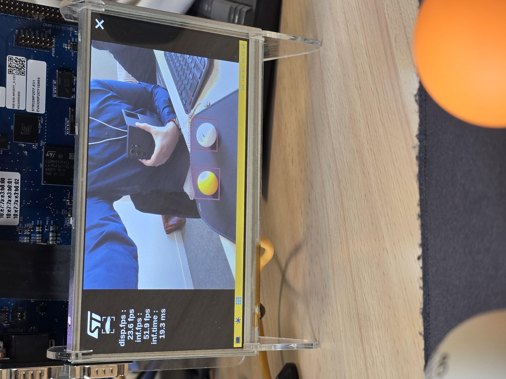
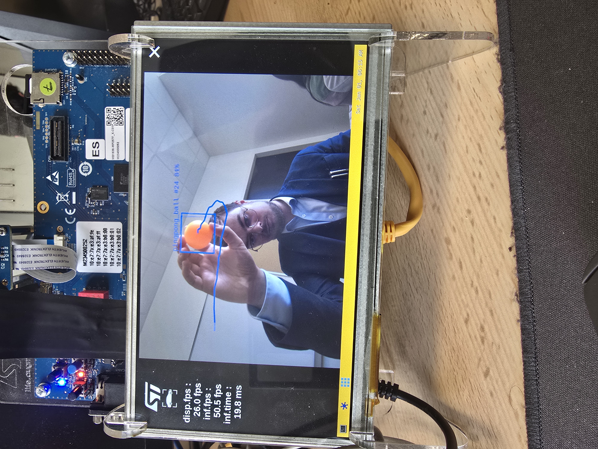

# Rapport (Steps 1 → 4) — Détection d’objets et tracking YOLOv8 sur STM32MPU

Ce rapport est une fusion des notes des steps 1 à 4 (Step 1 : `step1/README.md` + `step1/text.md`, Steps 2–4 : `step2/rapport_step2.md`, `step3/rapport_step3.md`, `step4/rapport_step4.md`). J’ai gardé un ton “étudiant” : ce que j’ai compris, ce que j’ai tenté, les erreurs classiques, et comment je m’en suis sorti.

---

## 1) Contexte & objectif

Le but du mini-projet est de construire une appli de vision “temps réel” sur STM32MPU :
- acquisition caméra via **GStreamer**,
- inférence sur un modèle optimisé (`.nb`),
- post-traitement (filtrage + **NMS**),
- affichage GTK (boîtes + texte),
- puis (Step 4) suivi d’objet (**tracking**) avec un ID stable + une petite trajectoire.

## 2) Vue d’ensemble (résumé en tableau)

| Step | Modèle | Nb classes | Labels | Sortie NN (idée) | Ajout principal |
|---|---:|---:|---|---|---|
| 1 | SSD Mobilenet v2 | 80 | `models/labels_coco_dataset_80.txt` | scores + boxes + anchors | Comprendre l’architecture existante |
| 2 | YOLOv8 (COCO) | 80 | `models/labels_coco_dataset_80_yolov8.txt` | `1×(4+80)×N` | Post-process YOLOv8 + réutilisation overlay |
| 3 | YOLOv8 pingpong | 1 | `models/labels_pingpong_ball.txt` | `1×(4+1)×N` | Robustesse 1 classe + couleurs par détection |
| 4 | YOLOv8 pingpong + ByteTrack | 1 | `models/labels_pingpong_ball.txt` | détections → tracks | Tracking (ID stable) + trajectoire |

## 3) Pipeline de l’application (ce que j’ai retenu)

Schéma mental (très simplifié) :

```text
Caméra -> GStreamer (resize/convert) -> Inference (.nb) -> Post-process (NMS)
   -> GTK Overlay (boxes + texte)
   -> (Step 4) ByteTrack -> GTK Overlay (ID + trajectoire)
```

Table des formats que je confondais au début :

| Où ? | Format boîte | Exemple | Utilisation |
|---|---|---|---|
| Sortie YOLOv8 (post-process) | normalisé | `x0,y0,x1,y1` dans `[0..1]` | facile à garder “indépendant” de la résolution |
| Tracking / dessin final | pixels | `x0,y0,x1,y1` en pixels | nécessaire pour dessiner sur une surface GTK |


## 4) Step 1 — Point de départ : SSD Mobilenet v2

Objectif : comprendre l’appli existante (où sont les pièces : caméra, NN, overlay).

Ressources (voir `step1/launch_python_object_detection.sh`) :

- Modèle : `models/ssd_mobilenet_v2_fpnlite_10_256_int8_per_tensor.nb`
- Labels : `models/labels_coco_dataset_80.txt`

### 4.1 Où se passe quoi ?

| Besoin | Où regarder |
|---|---|
| lancement / arguments / UI | `step1/stai_mpu_object_detection_starting_point.py` (classe `Application`) |
| pipeline GStreamer | `camera_dual_pipeline_creation` (classe `GstWidget`) |
| récupération d’une frame | callback `new_sample` (classe `GstWidget`) |
| inférence | `launch_inference` dans `step1/ssd_mobilenet_pp.py` |
| post-traitement SSD | `get_results` / `postprocess_predictions` dans `step1/ssd_mobilenet_pp.py` |
| dessin overlay | `drawing` (classe `OverlayWindow`) |

Détail important (que j’avais raté au début) :

- la **taille preview** est réglée via `frame_width` / `frame_height` et les caps côté GStreamer (`caps_src`),
- la **taille d’entrée NN** via `nn_input_width` / `nn_input_height` et les caps NN (`caps_src0`).

Autre détail : l’initialisation est dans `Application.__init__` et le point d’entrée est le bloc `if __name__ == '__main__'`.

### 4.2 Extrait (prétraitement / normalisation)

Ce passage m’a servi de repère : certains modèles attendent des entrées normalisées (float), d’autres non.

```python
# step1/ssd_mobilenet_pp.py
if self.input_tensor_infos[0].get_dtype() == np.float32:
    input_data = (np.float32(input_data) - self._input_mean) / self._input_std
```

### 4.3 Schéma bloc de l'application

#### Diagramme global de l’application (Step 4)





> Ce diagramme détaille le pipeline complet, du flux caméra à l’affichage, avec notes explicatives sur chaque bloc (voir le fichier pour la version annotée).


### 4.4 Difficultés rencontrées

- Comprendre la différence entre **taille preview** (écran) et **taille entrée NN** (souvent 256×256).
- Repérer où sont converties les coordonnées pour l’overlay (sinon on “répare” au mauvais endroit).

## 5) Step 2 — YOLOv8 object detection (COCO 80 classes)

Objectif : passer de SSD à YOLOv8 en gardant l’appli (pipeline + overlay) le plus intact possible.

Ressources (voir `step2/launch_python_object_detection.sh`) :

- Modèle : `models/yolov8s_integer_quant_256_fp32_io.nb`
- Labels : `models/labels_coco_dataset_80_yolov8.txt`

### 5.0 Objectifs et périmètre

- Porter l’application Step 1 (SSD Mobilenet v2) vers le modèle `yolov8s_integer_quant_256_fp32_io.nb` en gardant la détection multi-classes (COCO 80).
- Ajuster le lanceur pour utiliser le nouveau modèle + le bon fichier de labels YOLOv8.
- Concevoir un post-traitement dédié YOLOv8 en s’appuyant sur :
  - le post-traitement SSD Mobilenet v2 (Step 1),
  - un exemple de post-traitement YOLOv8 “pose estimation”.
- Vérifier que le format de sortie reste compatible avec l’overlay existant.

### 5.1 Analyse des modèles

| Modèle | Entrée | Sortie brute | Décodage | Labels |
|---|---|---|---|---|
| SSD Mobilenet v2 | `1×256×256×3` | 3 tenseurs (scores, boxes, anchors) | décodage anchors + NMS | COCO (ordre SSD) |
| YOLOv8 OD | `1×256×256×3` | `1×84×1344` | centre→coins + NMS | COCO (ordre YOLOv8) |

> Pour éviter toute ambiguïté sur les dimensions d'entrée et de sortie des modèles, j'ai utilisé l'outil **Netron** pour visualiser la structure des fichiers `.nb` et `.tflite`. Cela m'a permis de vérifier précisément la forme attendue des tenseurs (par exemple, `1×256×256×3` en entrée, `1×84×1344` en sortie pour YOLOv8), et d'adapter le post-traitement en conséquence. Cette étape a été essentielle pour ne pas se tromper lors de l'écriture du code de décodage et de la gestion des formats.

### 5.2 SSD vs YOLOv8 : pourquoi le post-process change ?

| Point | SSD Mobilenet v2 | YOLOv8 OD |
|---|---|---|
| Type | anchor-based | anchor-free |
| Sorties | 3 tenseurs (scores/boxes/anchors) | 1 tenseur (boxes+classes) |
| Travail côté CPU | décoder anchors + NMS | centre→coins + NMS |


En pratique (pour ce modèle), la sortie YOLOv8 ressemble à :

- forme brute : `1 × 84 × 1344` (donc `4 + 80` et `N=1344`)
- pour chaque détection : `[x_center, y_center, w, h, score_class0..score_class79]`




> Ce diagramme Netron montre la structure du modèle YOLOv8, confirmant que l'entrée est de forme `1×256×256×3` et la sortie de forme `1×84×1344`.


### 5.3 Comparaison avec des post-traitements existants (SSD / YOLOv8 pose / YOLOv8 OD)

- **SSD Mobilenet v2** (`step1/ssd_mobilenet_pp.py`) :

  - sorties : scores + boxes relatives aux anchors + anchors,
  - étapes : décoder les anchors → filtrer → NMS (dans le code : `postprocess_predictions` appelle `decode_predictions` puis `non_max_supression`).

- **YOLOv8 pose estimation** (référence) :

  - sortie dense : ~2100 détections, 56 valeurs chacune (boîte + 17 keypoints),
  - approche : garder le score “personne”, faire centre→coins, appliquer NMS, puis gérer les keypoints (pas utilisé en object detection).

- **Impacts pour YOLOv8 object detection** :

  - sortie unique `1×84×1344` : pour chaque détection, on prend la meilleure classe + score, centre→coins, NMS,
  - pas d’anchors à décoder,
  - but : ressortir le même format final que SSD pour ne pas toucher à l’overlay.

Récap (et pourquoi on fait toujours une NMS) :

| Modèle | Sortie modèle | Étapes post-process | Pourquoi NMS ? |
|---|---|---|---|
| SSD Mobilenet v2 | scores + boxes + anchors | decode → filtre → NMS | éviter les boîtes dupliquées |
| YOLOv8 pose | box centre + keypoints + score personne | filtre → centre→coins → NMS (+ keypoints) | garder une box/pose par personne |
| YOLOv8 OD | box centre + scores classes | meilleure classe → filtre → centre→coins → NMS | garder une box par objet |

### 5.4 Post-traitement YOLOv8 (extrait de code)

Le cœur du Step 2/3/4 est ce pattern :

```python
# step3/yolov8_post_process.py (même idée en step2)
output_data = np.transpose(outputs)  # (N, C+4)
for det in output_data:
    x_c, y_c, w, h = det[:4]
    class_scores = det[4:]
    best_class = int(np.argmax(class_scores))
    best_score = float(class_scores[best_class])
    if best_score < self.confidence_threshold:
        continue
    x0 = x_c - w / 2.0; y0 = y_c - h / 2.0
    x1 = x_c + w / 2.0; y1 = y_c + h / 2.0
    candidates.append([x0, y0, x1, y1, best_score, best_class])
final_dets = self.non_max_suppression(candidates, self.iou_threshold)
```

Et derrière, une NMS “maison” simple (tri par score, puis suppression si IoU trop grande).

Mini-extrait (idée de la NMS, sans les détails IoU) :

```python
# step3/yolov8_post_process.py
detections = sorted(detections, key=lambda x: x[4], reverse=True)  # score desc
keep = []
while detections:
    best = detections.pop(0)
    keep.append(best)
    detections = [d for d in detections if self.iou(d, best) < iou_thresh]
```

### 5.4.1 Détails “procédure Step 2”

1) **Récupérer la sortie du modèle** (sortie unique) :
```python
output = self.stai_mpu_model.get_output(index=0)  # 1 x 84 x 1344
detections = self.postprocess_yolov8(np.squeeze(output))
```
`np.squeeze` enlève la dimension batch. Le `transpose` est fait dans `postprocess_yolov8` pour obtenir des lignes de détections (ex. `1344 × 84`).

2) **Parcourir chaque détection** :

- récupérer `(x_c, y_c, w, h)`,
- prendre la meilleure classe (`argmax`) + son score,
- filtrer avec `confidence_threshold`,
- convertir centre → coins.

3) **Appliquer la NMS** sur des candidats `[x0, y0, x1, y1, score, class_id]`.

4) **Adapter le format de sortie** pour l’overlay (dimension batch conservée) :

- `boxes` : `(1, N, 4)`
- `classes` : `(1, N)`
- `scores` : `(1, N)`

5) **Compatibilité overlay** : conserver `model_type = "ssd_mobilenet_v2"` pour réutiliser la branche de rendu existante.

Note du rapport Step 2 : l’initialisation du modèle profite de l’accélération matérielle quand le modèle est au format `.nb`.

### 5.5 Choix de compatibilité (pour éviter de casser l’overlay)

Au lieu de refactor toute l’UI, j’ai choisi de **sortir exactement ce que l’overlay attendait déjà** :

- `boxes` en `(1, N, 4)`,
- `classes` en `(1, N)`,
- `scores` en `(1, N)`.

Ça explique aussi pourquoi on garde une branche d’affichage “compatible SSD” dans la logique de l’appli (même si le modèle n’est plus SSD).
Dans le rapport Step 2, l’idée est vraiment “zéro refactor UI” : même rescaling des coordonnées et même logique de coloration déjà en place.

### 5.6 Adaptations applicatives

**a) Lanceur** (`step2/launch_python_object_detection.sh`) :

- appelle l’appli Step 2,
- charge modèle YOLOv8 + labels YOLOv8,
- réutilise les mêmes variables `DFPS`, `DWIDTH`, `DHEIGHT`, `CAMERA_SRC` que le Step 1.

**b) Application principale** (`step2/stai_mpu_yolov8_object_detection.py`) :

- pipeline vidéo + overlay identiques au Step 1,
- seul changement : `NeuralNetwork` provient de `step2/yolov8_post_process.py` (au lieu de SSD).

**c) Post-process legacy (référence)** (`step2/yolov8_object_detection_pp.py`) :

- ancien squelette “style SSD” conservé pour comparaison/debug,
- non utilisé par le lanceur principal.

### 5.7 Implications clés / attentes couvertes

- YOLOv8 étant *anchor-free* : centre/largeur/hauteur → coins + NMS suffit.
- Multi-classes COCO : on charge les labels YOLOv8 (ordre YOLOv8), et on choisit la classe max par détection.
- Overlay réutilisé : coordonnées normalisées → rescaling dans l’overlay comme avant.
- Seuils réglables : `--conf_threshold` et `--iou_threshold` (par défaut `0.65` / `0.45`).

### 5.8 Ce qui change vs Step 1

- SSD : décodage anchors obligatoire ; YOLOv8 : lecture directe centre/largeur/hauteur.
- SSD : 3 tenseurs ; YOLOv8 : 1 tenseur (`84×1344`), lecture `get_output(index=0)`.
- Labels : COCO “ordre SSD” → COCO “ordre YOLOv8”.
- UI : inchangée (transition plus sûre).

### 5.9 Difficultés rencontrées

- La première fois, j’ai inversé les dimensions : sans la **transpose**, on parcourt `84` “détections” au lieu de `1344`, et tout devient incohérent.
- Attention à l'ordre des labels : **COCO SSD** ≠ **COCO YOLOv8** (il faut le bon fichier `labels_coco_dataset_80_yolov8.txt`).
- Les boxes YOLOv8 sont en **centre/largeur/hauteur**, alors que l’overlay dessine en **coins**.

## 6) Step 3 — YOLOv8 pingpong ball (1 classe) + affichage adapté

Objectif : utiliser un modèle spécialisé `pingpong_ball` (1 classe) sans casser le post-process ni rendre l’affichage “plat”.

Ressources (voir `step3/launch_python_object_detection.sh`) :

- Modèle : `models/yolov8n_integer_quant_256_1c_pingpongball_2_fp32_io.nb`
- Labels : `models/labels_pingpong_ball.txt`

### 6.0 Objectifs et périmètre

- Adapter l’appli Step 2 pour le modèle pingpong `yolov8n_integer_quant_256_1c_pingpongball_2_fp32_io.nb`.
- Utiliser un fichier de labels 1 classe (`labels_pingpong_ball.txt`, contenu : `pingpong_ball`).
- Conserver : score au-dessus des boîtes + couleurs différentes par boîte (même avec 1 classe).

### 6.1 Ce qui change (et ce qui ne change pas)

- Le post-process reste valable car il fait `class_scores = det[4:]` : que ce soit 80 classes ou 1 classe, ça marche.
- Le piège, c’est l’affichage : si on choisit une couleur “par classe”, avec 1 classe on a toujours la même couleur → difficile à lire.

Points qui doivent rester vrais :

- format de sortie du post-process : `(1, N, 4)`, `(1, N)`, `(1, N)` (pour réutiliser l’overlay),
- `model_type` reste `"ssd_mobilenet_v2"` pour que la branche d’affichage existante fonctionne sans modification.

Extrait “robustesse au nombre de classes” :

```python
output = self.stai_mpu_model.get_output(index=0)
detections = self.postprocess_yolov8(np.squeeze(output))
output_data = np.transpose(outputs)  # (N, C+4)
```

### 6.2 Extrait : palette indépendante du nombre de classes

```python
# step3/stai_mpu_yolov8_object_detection.py
palette_size = 32
for _ in range(palette_size):
    bbcolor = (random.random(), random.random(), random.random())
    bbcolor_list.append(bbcolor)
```

Puis la couleur est choisie **par détection** (index modulo) : `color_idx = i % len(self.bbcolor_list)`.

### 6.3 Difficultés rencontrées

- J’ai dû penser “UI” : techniquement la détection marche, mais si l’affichage est confus on croit que le modèle se trompe.
- Avec des petits objets (balle), le réglage `--conf_threshold` a un vrai impact : trop haut → rien ne s’affiche.

### 6.4 Lanceur

```sh
/usr/local/x-linux-ai/workspace/step3/stai_mpu_yolov8_object_detection.py \
    -m /usr/local/x-linux-ai/workspace/models/yolov8n_integer_quant_256_1c_pingpongball_2_fp32_io.nb \
    -l /usr/local/x-linux-ai/workspace/models/labels_pingpong_ball.txt \
    --framerate $DFPS --frame_width $DWIDTH --frame_height $DHEIGHT --camera_src $CAMERA_SRC
```

### 6.5 Résultat obtenu

- Détection pingpong : OK, via modèle 1 classe + label unique.
- Score au-dessus de la box : conservé.
- Couleurs distinctes par box : palette fixe (32 couleurs) + index modulo.



> Résultat obtenu : détection pingpong avec overlay, score au-dessus de la boîte, couleurs distinctes par boîte.

## 7) Step 4 — Tracking ByteTrack (ID stable + trajectoire)

Objectif : ajouter le suivi temps réel pour avoir une couleur stable par balle, un `track_id`, et une petite “traînée” de mouvement.

Fichiers importants :
- Tracking + overlay : `step4/stai_mpu_yolov8_object_detection.py`
- Post-process : `step4/yolov8_post_process.py` (copie du Step 3)

### 7.0 Objectifs et périmètre

- Reprendre l’appli Step 3 (détection ping-pong) et ajouter un suivi temps réel avec ByteTrack (lib `supervision`).
- Affichage demandé : couleur stable par ID, score au-dessus de la boîte, trajectoire courte (mémoire 30 frames).

### 7.0.1 Modèle / labels / lanceur

- Modèle : `models/yolov8n_integer_quant_256_1c_pingpongball_2_fp32_io.nb`
- Labels : `models/labels_pingpong_ball.txt` (contenu : `pingpong_ball`)
- Lanceur : `step4/launch_python_object_detection.sh`

### 7.1 Post-traitement YOLOv8 (inchangé vs Step 3)

Le Step 4 conserve le même post-traitement que le Step 3 (`step4/yolov8_post_process.py`) :

- lecture `get_output(index=0)`,
- `np.squeeze` + transpose (forme `(N, C+4)`),
- meilleure classe + seuil,
- centre→coins + NMS,
- sortie `(1,N,4)/(1,N)/(1,N)` pour réutiliser l’overlay.

Création du tracker (version simple, sans paramètres) :

```python
import supervision as sv
self.byte_tracker = sv.ByteTrack()
```

### 7.2 Extrait : conversion normalisé → pixels + ByteTrack

```python
# step4/stai_mpu_yolov8_object_detection.py
scale = np.array([self.frame_width, self.frame_height, self.frame_width, self.frame_height], dtype=np.float32)
boxes = boxes_norm[:, :4] * scale  # xyxy en pixels
detections = sv.Detections(
    xyxy=np.array(boxes, dtype=np.float32),
    confidence=np.array(self.nn_result_scores[0], dtype=np.float32),
    class_id=np.array(self.nn_result_classes[0], dtype=int),
)
tracked = self.byte_tracker.update_with_detections(detections)
```

Ensuite on garde un historique court des centroïdes (30 points max) pour dessiner la trajectoire.

Intégration “dans le flow” (appel juste après l’inférence) :

```python
self.app.nn_result_locations, self.app.nn_result_classes, self.app.nn_result_scores = self.nn.get_results()
self.app.apply_tracking()
```

### 7.3 Extrait : couleur stable par ID + trajectoire

```python
# step4/stai_mpu_yolov8_object_detection.py
color_idx = track_id % len(self.bbcolor_list)  # stable dans le temps
text_to_display = f"{label} #{track_id} {int(accuracy)}%"
history = self.app.track_history.get(track_id, [])
```

### 7.4 Garde-fous (forme invalide / aucune détection)

J'ai dû mettre en place deux garde-fous (sinon ça plante facilement sur une frame sans détection) :

```python
boxes_norm = np.array(self.nn_result_locations[0], dtype=np.float32)
if boxes_norm.ndim != 2 or boxes_norm.shape[1] < 4:
    self.tracked_boxes = np.empty((0, 4))
    self.track_history = {}
    return
```

Ici, on vérifie que `boxes_norm` a bien la forme attendue `(N, 4)`.

Puis, lors de l’appel à `apply_tracking()`, on vérifie si `tracked` est vide.

Et si aucune détection : purge des boîtes/ids/historique sur la frame courante.

### 7.5 Difficultés rencontrées

- Cas “pas de détection” : sans garde-fous, le tracking/overlay peut lever des erreurs. La solution a été de **vider** `tracked_boxes/ids/history` sur la frame courante.
- Petit effet “tremblement” : si la balle disparaît 1–2 frames, l’ID peut changer (limite normale du tracking selon la scène).

### 7.6 Overlay GTK : ce qui a été modifié

- `drawing()` utilise désormais les sorties trackées : `tracked_boxes`, `tracked_ids`, `tracked_scores`.
- Les boîtes trackées sont déjà en pixels ; elles sont ensuite re-scalées vers la zone d’affichage.
- Le texte devient : `label #id conf%`.
- La couleur est stable : palette fixe (32 couleurs) indexée par `track_id`.
- La trajectoire est une ligne entre les centroïdes mémorisés (max 30 points), avec la même couleur que la boîte.

### 7.7 Lanceur

```sh
/usr/local/x-linux-ai/workspace/step4/stai_mpu_yolov8_object_detection.py \
    -m /usr/local/x-linux-ai/workspace/models/yolov8n_integer_quant_256_1c_pingpongball_2_fp32_io.nb \
    -l /usr/local/x-linux-ai/workspace/models/labels_pingpong_ball.txt \
    --framerate $DFPS --frame_width $DWIDTH --frame_height $DHEIGHT --camera_src $CAMERA_SRC
```

### 7.8 Résultat obtenu



> Résultat obtenu : détection pingpong avec overlay, score au-dessus de la boîte, couleurs distinctes par boîte, ID stable, trajectoire courte.
## 8) Paramètres utiles (quand on veut régler vite)

| Paramètre | Où | Rôle | Valeur par défaut (Step 2) |
|---|---|---|---:|
| `--conf_threshold` | CLI | seuil minimum de score | `0.65` |
| `--iou_threshold` | CLI | seuil IoU pour la NMS | `0.45` |
| `--input_mean/std` | CLI | normalisation éventuelle | `127.5 / 127.5` |

Astuce simple :
si “trop de boîtes” → monter `conf_threshold`.
Si “plus rien” → baisser `conf_threshold`.

## 9) Lancement (scripts fournis)

Chaque step a un lanceur :
- `./step[NB]/launch_python_object_detection.sh`

Ces scripts récupèrent en général des variables comme `DFPS`, `DWIDTH`, `DHEIGHT`, `CAMERA_SRC` (via `config_board_*.sh`) pour choisir FPS, résolution et source caméra.

## 10) Bilan personnel

- Passer d’un modèle à un autre, ce n’est pas “juste changer le fichier `.nb`” : le **format de sortie** dicte le post-traitement.
- La majorité des bugs viennent de : dimensions (`transpose`), labels (ordre), et normalisé vs pixels.
- Réutiliser l’overlay existant m’a fait gagner du temps, même si ça impose des choix un peu “pragmatiques” sur les formats de sortie.

## 11) Pistes d’amélioration (si j’avais plus de temps)

- Ajouter un mode “debug” qui affiche : nombre de candidats avant/après NMS, meilleur score, FPS.
- Paramétrer ByteTrack (seuils) selon la scène pour réduire les changements d’ID quand l’objet disparaît brièvement.
- Implémenter un fade out des trajectoires (au lieu de couper net à 30 points).
- Implémenter le step bonus avec la heatmap des trajectoires.
